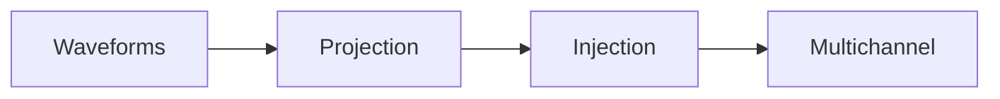

# User guide

**gwmock-signal** provides small, composable building blocks for **time-domain
GW signal simulation** in Python, aligned with **LALSimulation** / optional
**PyCBC**, **GWpy**, and typical LIGO/Virgo/KAGRA analysis habits. The parent
**gwmock** package (separate repo) is intended to orchestrate full mock-data
challenges; this library focuses on the physics-adjacent primitives.

## Typical pipeline

**User guide → Command-line interface** documents the **`gwmock-signal`**
console script (`inject cbc`, logging). Use it when you want a shell-first
workflow; use the Python API when you are already inside a notebook or pipeline.

Under **User guide → Examples** in the sidebar:

1. **[Waveforms](waveform.md)** — Produce $h_{+}$, $h_{\times}$ via LAL
   (default) or PyCBC (optional); registry for custom models.
2. **[Detector projection](detector-projection.md)** — Map polarizations to each
   IFO strain using antenna patterns and delays.
3. **[Strain injection](strain-injection.md)** — Add simulated strain into a
   longer GWpy segment (e.g. zeros or noise).
4. **[Multichannel strains](multi-channel-strains.md)** — Stack per-detector
   series in a fixed order for array-oriented code.

Example pages are **narrative + copy-paste snippets**. **Authoritative API
details** (signatures, types, exceptions) are only in **API** (auto-generated
from docstrings):

| Topic                               | Examples (this site)                                                                                                          | Reference (signatures & types)                                       |
| ----------------------------------- | ----------------------------------------------------------------------------------------------------------------------------- | -------------------------------------------------------------------- |
| Waveforms                           | [Waveforms](waveform.md)                                                                                                      | [Waveform API](../api/waveform/)                                     |
| Projection                          | [Detector projection](detector-projection.md)                                                                                 | [Projection API](../api/projection/)                                 |
| Injection                           | [Strain injection](strain-injection.md)                                                                                       | [Injection API](../api/injection/)                                   |
| Multichannel                        | [Multichannel strains](multi-channel-strains.md)                                                                              | [Multichannel API](../api/multichannel/)                             |
| CBC pipeline (Python)               | _(use strains + injection pages, or the CLI)_                                                                                 | [Pipeline API](../api/pipeline/), [Simulator API](../api/simulator/) |
| gwmock-pop backends                 | [README](https://github.com/Leuven-Gravity-Institute/gwmock-signal/blob/main/README.md) (`resolve_simulator_backend` example) | [Registry API](../api/registry/)                                     |
| Detector networks (presets / files) | [Command-line interface](cli.md) (`--network`)                                                                                | [Network API](../api/network/)                                       |
| Shell / Typer CLI                   | [Command-line interface](cli.md)                                                                                              | _(no generated API page)_                                            |

## Prerequisites

- Install the package (see [Installation](installation.md)).
- For a minimal environment check, see [Quick Start](quick_start.md).

## See also

- [API overview](../api/index.md) — all reference sections
- [Documentation home](../index.md)
- [Contributing](../contributing.md)
